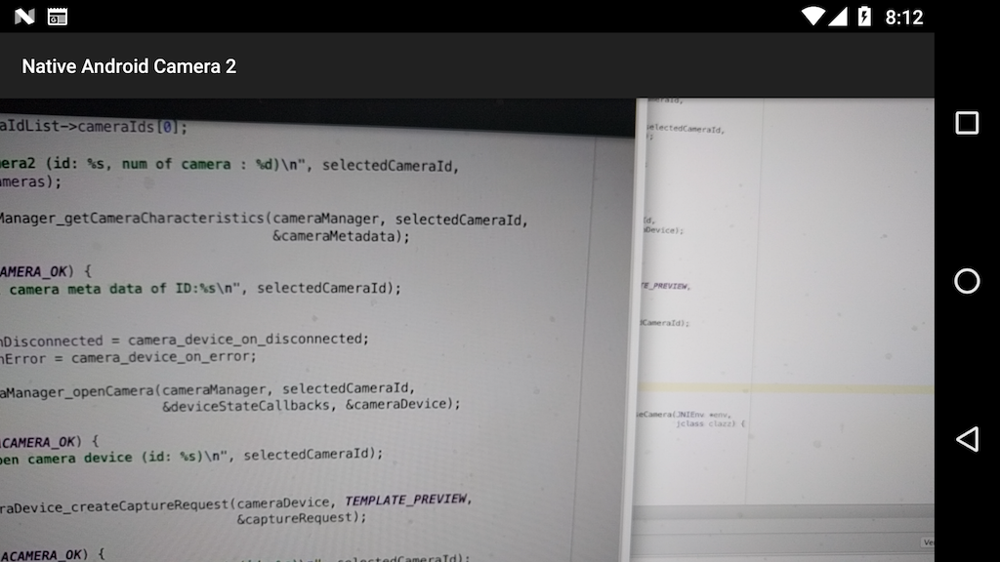

Hello Camera2
=============
Hello Camera2 is an Android Camera2 sample that plays preview.

It controls camera devices by NDK camera2 APIs which becomes one of 
[public libraries](http://android-developers.blogspot.kr/2016/06/improving-stability-with-private-cc.html)
in Android N.

Pre-requisites
--------------
- Android Studio 2.1+ with [NDK](https://developer.android.com/ndk/) (>=r12) bundle.

Screenshots
-----------

A small extra view is toggled when a screen is touched.

Known Bugs
----------
 * When extra surface view is changed, App is crashed. (e.g when switching portrait to landscape mode, vice versa)
